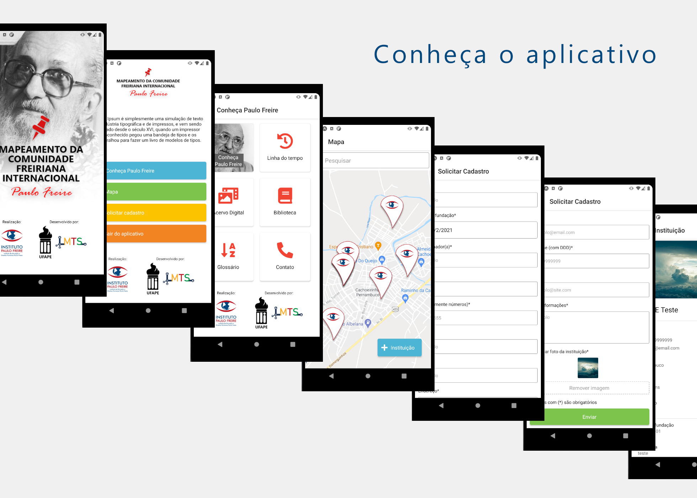

<h1 align="center">
  
</h1>

 

  

## Tecnologias

Esse projeto foi desenvolvido com as seguintes tecnologias:

- [React Native](https://reactnative.dev/)
- [Expo](https://expo.io/)
- [JavaScript](https://developer.mozilla.org/pt-BR/docs/Web/JavaScript/)

## Projeto

Aplicativo Mapeamento da Comunidade Freiriana Internacional, que lista instituições que portam o nome de Paulo Freire ou nele se inspiram para as suas ações.

## Como executar

- Clone o repositório
- Instale as dependências com `yarn`
- Inicie o projeto com `expo start`